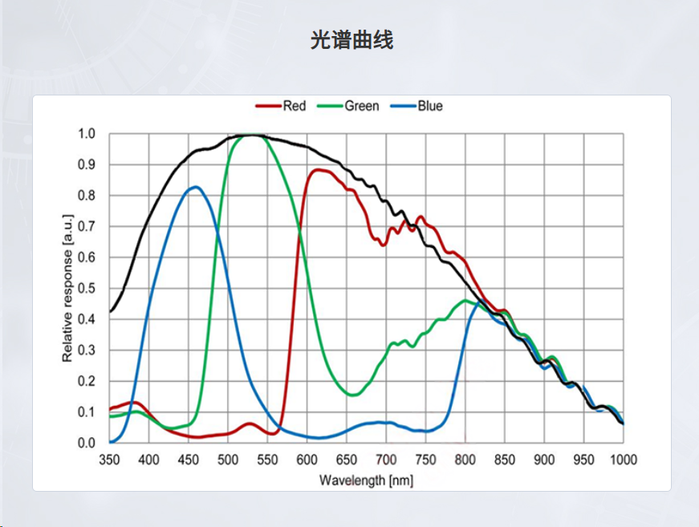
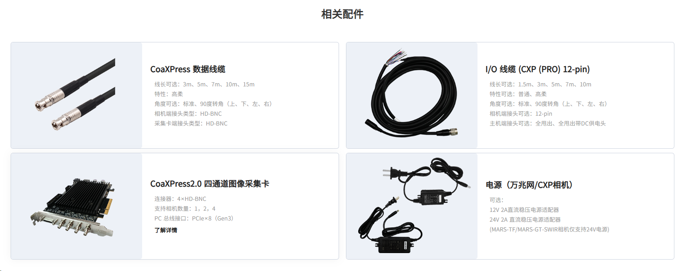

# MARS-2442-192X2M-NF — 大恒图像火星系列 CXP2.0 黑白工业相机

## 一句话定位
高分辨率（2440 万像素）、高帧率（192 fps）、CXP2.0 接口的全局快门黑白工业相机，
适合对速度和分辨率都有要求的机器视觉检测场景。

## 核心规格
| 项目 | 参数 |
|------|------|
| 分辨率 | 5312 × 4608（约 24.4 MP） |
| 帧率 | 192.01 fps |
| 传感器 | Sony IMX935，全局快门 CMOS |
| 靶面 | 14.55 × 12.63 mm |
| 像元尺寸 | 2.74 μm |
| 接口 | CoaXPress 2.0，**CXP-12 × 4 通道**（HD-BNC，单链路 12.5 Gbit/s），PoCXP 供电 |
| 镜头接口 | C 口 |
| 像素格式 | Mono8 / Mono10 / Mono12 |
| 曝光 | 5 μs ~ 1 s |
| 增益 | 数字 0~16 dB；模拟 0~24 dB |
| I/O | 1 光耦入 / 1 光耦出 / 1 GPIO / 1 RS232 |
| 供电 / 功耗 | DC 24V 或 PoCXP；15.2 W（黑白）/ 13.7 W（彩色） |
| 尺寸/重量 | 74×74×76 mm / 510 g（风扇散热） |
| 工作温度 | 0 ~ 45 °C |

## 选型要点
- **CXP2.0 优势**：12.5 Gbit/s 带宽 + PoCXP 单线缆供电，远距离（线缆可选 15m）稳定传输，适合大分辨率高帧率。
- **全局快门**：运动物体无拖影，适合产线动态检测。
- **注意风扇散热**：有风扇、工作温度仅 0~45°C，高粉尘/高温环境需评估；对静音/免维护场景要权衡。
- **需配采集卡**：CXP 接口必须配 CoaXPress 采集卡（如大恒四通道 PCIe×8 Gen3 卡），不是直接连电脑。

## 适用场景
- 高分辨率尺寸测量、缺陷检测（如面板、半导体、锂电）
- 高速产线动态抓拍（192 fps）
- 多相机同步（支持序列控制、参数组、多拐点曝光）

## 配套
- CXP 数据线缆（HD-BNC，3~15m）、I/O 线缆（12-pin）
- CoaXPress 2.0 采集卡（PCIe×8 Gen3）、24V 2A 电源
- 软件：大恒 Galaxy SDK / MVS，兼容 GenICam

## 原始资料
- [官方 Datasheet PDF（本地，3 页）](../../../原始资料/规格书/MARS-2442-192X2M-NF-Datasheet-CN.pdf)
- [产品页存档](../../../原始资料/规格书/MARS-2442-192X2M-NF.md)
- Datasheet（中文 PDF）：[下载](https://www.daheng-imaging.com/index.php?m=content&c=index&a=file_down&f=%2Fuploadfile%2F2026%2F0703%2F20260703100645583.pdf)

## 对比实验
- 与埃科 [[TS21MCXP12-230M]]（21MP，4.5 μm）做过 PCB 实拍景深对比：本机 2.74 μm 像元、0.39× 倍率，**景深更大**，拍板面高处元件与丝印更清晰 → [21MP对比24MP-相机景深实验](../../综合分析/21MP对比24MP-相机景深实验.md)

## 笔记
_（待主人补充：实际用在哪个项目、为什么选它、踩过的坑、与哪款镜头/光源搭配）_

## 图片资料

### 已标注
- **光谱响应曲线**：
  - Sony IMX935 相对响应曲线，覆盖 350~1000 nm；R/G/B 通道峰值分别约在 600/550/450 nm，近红外段响应持续至 1000 nm。
- **相关配件**：
  - CoaXPress 数据线缆、I/O 线缆（CXP PRO 12-pin）、CoaXPress 2.0 四通道图像采集卡、24V 电源适配器。
