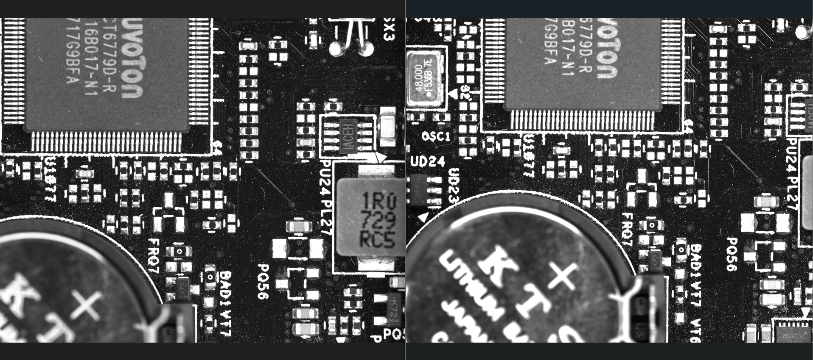
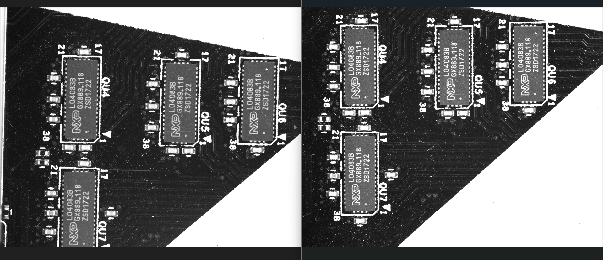
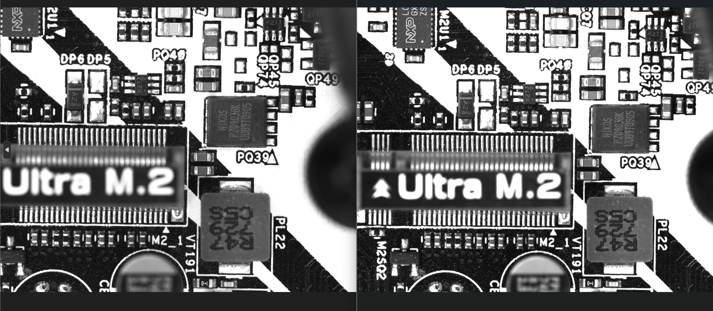
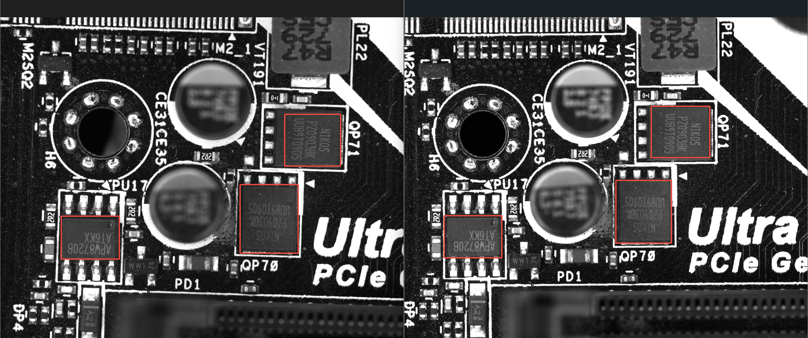

# 2100 万相机 vs 2400 万相机：景深实拍对比实验

## 实验背景
电路板（PCB）检测中，板面元件有高低落差，需要足够景深让**高处元件**和**板面丝印**同时清晰。本实验用两台相机在同镜头、同光圈、同光源条件下实拍对比。

## 实验条件
| 项目 | 相机1（左） | 相机2（右） |
|------|-----------|-----------|
| 相机 | [[TS21MCXP12-230M]]（埃科 TAURUS，21MP） | [[MARS-2442-192X2M-NF]]（大恒火星，24.4MP） |
| 像元尺寸 | 4.5 μm | 2.74 μm |
| 镜头放大倍率 | 0.68× | 0.39× |
| 镜头 | 220 mm 焦距、光圈 f8（两台相同） | 同左 |
| 光源 | 亮度相同 | 同左 |

> 物方分辨率（像元尺寸 ÷ 倍率）：相机1 ≈ 6.6 μm/px，相机2 ≈ 7.0 μm/px，两者接近；视野也接近——对比是公平的。

## 实验结论
1. **焦点落在电路板表面时，相机2（右侧）景深更大**：位置更高的元件依然清晰；
2. 相机2 画面中**元件丝印、印刷字体明显更清晰**（多页重复验证）；
3. 原因：相机2 放大倍率低（0.39× vs 0.68×），景深随倍率降低而显著增大。在物方分辨率相近的前提下，**小像元 + 低倍率**方案在景深上占优。

## 经验沉淀（选型指导）
- 拍**有高低落差的目标**（PCB 元件、焊点、结构件）时，景深往往比极限分辨率更决定清晰度；
- 同样视野、相近采样精度下，优先考虑 **小像元相机 + 低倍率镜头**（景深更大）；
- 反之，若目标基本是平面、追求极限分辨率或进光量，大像元 + 高倍率方案仍有价值。

## 实验图片
> 每组图**左侧 = 相机1（埃科 21MP）**，**右侧 = 相机2（大恒 24MP）**。

1. 焦点在板面：右侧更高处的元件更清晰（景深差异）：

2. 焦点在板面：右侧元件丝印更清晰：

3. 右侧元件丝印和印刷字体更清晰：

4. 右侧元件丝印更清晰：

## 原始资料
- [实验 PPT（原件）](../../原始资料/文章/相机实验对比-21MP对比24MP.pptx)
- 相机规格页：[TS21MCXP12-230M](../硬件/相机/TS21MCXP12-230M.md) ｜ [MARS-2442-192X2M-NF](../硬件/相机/MARS-2442-192X2M-NF.md)
